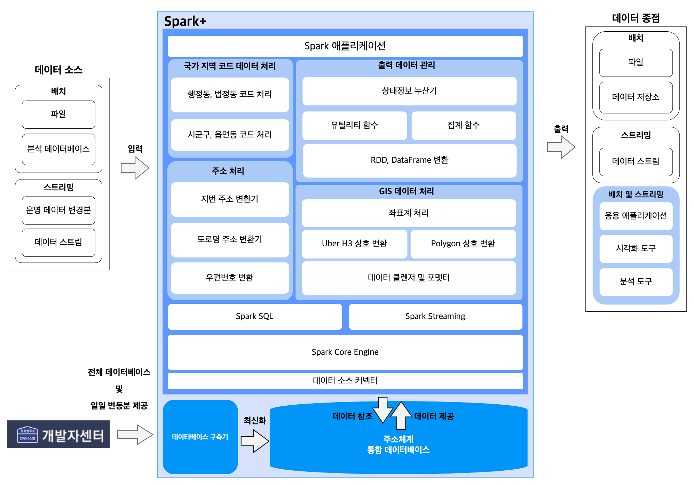
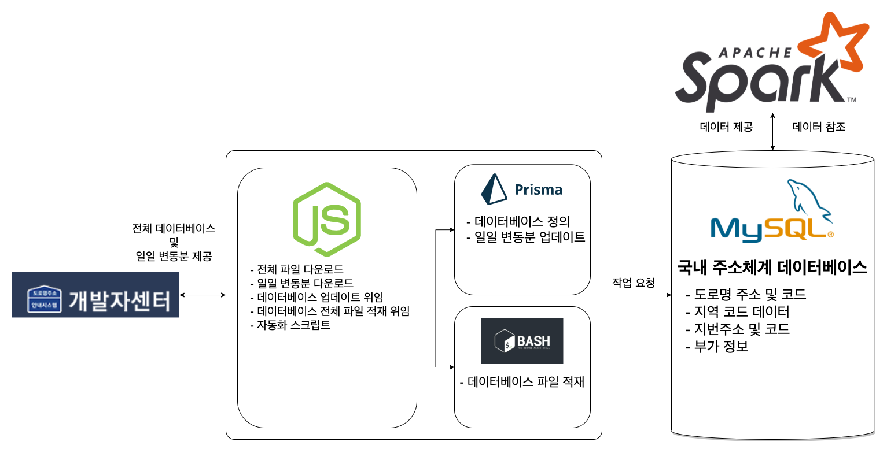

# db-updater

`db-updater`는 혼재된 국내 주소체계 데이터를 안정적이고 효율적으로 제공하기 위해 **국내 주소체계 데이터베이스 구축 및 최신화를 자동화**하는 시스템을 `Node.js`로 구현하는 프로젝트입니다.

## 빠른 시작

이 프로젝트는 `Node.js`, `Docker` 및 `docker-compose` 의존성으로 가집니다. 의존성이 설치되어있지 않을 경우 실행할 수 없으니 설치가 필요합니다.

- [Node.js 다운로드](https://nodejs.org/en/download/)
- [Docker 다운로드](https://docs.docker.com/get-docker/)
- [docker-compose 다운로드](https://docs.docker.com/compose/install/)

```s
# 이 예제는 Linux 서버에서 시스템을 구축하는 예제를 구현합니다.

###
# 1. 레포지토리 클론
###

$ git clone https://github.com/SWM-SparkPlus/db-updater.git
$ cd db-updater

###
# 2. 환경변수 설정
###

# .env 파일의 DATABASE_URL, MYSQL_HOST, MYSQL_PORT, MYSQL_DATABASE, MYSQL_USER, MYSQL_PASSWORD, MYSQL_ROOT_PASSWORD 를 채워야 합니다.
# 예제에서는 .env.example의 예제 환경변수를 그대로 사용합니다.

cat .env.example > .env

###
# 3. 프로젝트 의존성 설치
###

$ npm install

###
# 4. 주소 데이터베이스 전체분 다운로드(약 2분 소요)
###

$ npm run download:total

###
# 5. 데이터베이스 서버 실행(docker-compose 사용)
###

$ docker-compose up -d

###
# 6. 다운로드받은 파일을 데이터베이스에 import 합니다.
###

$ npm run setup:import:only

```

## 특징

1. 국내 최초의 한국 주소체계 데이터베이스 자동화 구축 및 최신화 시스템
2. AMD64 아키텍처 기반 UNIX 서버 최적화 (2 Core 4 Thread vCPU기준 3분 내 구축 가능)
3. 오전 8시 데이터베이스 최신화 업데이트 동작

## 아키텍처

### Spark+ 전체 아키텍처



### db-updater 아키텍처



## 도로명주소 데이터베이스 테이블 관계도


출처: [도로명주소 개발자센터](https://www.juso.go.kr/addrlink/addressBuildDevNew.do?menu=match)

### 도로명코드 테이블

| 순번 | 컬럼명          | 크기 | 형식 | PK  | 비고                                                                                       |
| ---- | --------------- | ---- | ---- | --- | ------------------------------------------------------------------------------------------ |
| 1    | 도로명코드      | 12   | 문자 | PK1 |                                                                                            |
| 2    | 도로명          | 80   | 문자 |     |                                                                                            |
| 3    | 도로명 로마자   | 80   | 문자 |     |                                                                                            |
| 4    | 읍면동일련번호  | 2    | 문자 | PK2 |                                                                                            |
| 5    | 시도명          | 20   | 문자 |     |                                                                                            |
| 6    | 시도명 로마자   | 40   | 문자 |     |                                                                                            |
| 7    | 시군구명        | 20   | 문자 |     |                                                                                            |
| 8    | 시군구명 로마자 | 40   | 문자 |     |                                                                                            |
| 9    | 읍면동명        | 20   | 문자 |     |                                                                                            |
| 10   | 읍면동명 로마자 | 40   | 문자 |     |                                                                                            |
| 11   | 읍면동구분      | 1    | 문자 |     | 0: 읍면, 1: 동, 2: 미부여                                                                  |
| 12   | 읍면동코드      | 3    | 문자 |     | 법정동기준읍면동코드                                                                       |
| 13   | 사용여부        | 1    | 문자 |     | 0: 사용, 1: 미사용                                                                         |
| 14   | 변경사유        | 1    | 문자 |     | 0: 도로명변경, 1: 도로명폐지, 2: 시도시군구변경, 3: 읍면동변경, 4: 영문도로명변경, 9: 기타 |
| 15   | 변경이력정보    | 14   | 문자 |     | 도로명코드(12) + 읍면동일련번호(2). 신규일 경우 "신규"로 표시                              |
| 16   | 고시일자        | 8    | 문자 |     | YYYYMMDD 형식 준수                                                                         |
| 17   | 말소일자        | 8    | 문자 |     | YYYYMMDD 형식 준수                                                                         |

### 도로명주소 테이블

| 순번 | 컬럼명            | 크기 | 형식 | PK  | 비고                         |
| ---- | ----------------- | ---- | ---- | --- | ---------------------------- |
| 1    | 관리번호          | 25   | 문자 | PK  |                              |
| 2    | 도로명코드        | 12   | 문자 |     | FK1                          |
| 3    | 읍면동일련번호    | 2    | 문자 |     | FK2                          |
| 4    | 지하여부          | 1    | 문자 |     | 0: 지상, 1: 지하             |
| 5    | 건물본번          | 5    | 숫자 |     |                              |
| 6    | 건물부번          | 5    | 숫자 |     |                              |
| 7    | 기초구역번호      | 5    | 문자 |     |                              |
| 8    | 변경사유코드      | 2    | 문자 |     | 31: 신규, 34: 변경, 63: 폐지 |
| 9    | 고시일자          | 8    | 문자 |     | NULL                         |
| 10   | 변경전 도로명주소 | 25   | 문자 |     | NULL                         |
| 11   | 상세주소 부여여부 | 1    | 문자 |     | 0: 미부여, 1: 부여           |

### 지번주소 테이블

| 순번 | 컬럼명         | 크기 | 형식 | 비고                     |
| ---- | -------------- | ---- | ---- | ------------------------ |
| 1    | 관리번호       | 25   | 문자 | PK1, FK                  |
| 2    | 일련번호       | 3    | 숫자 | PK2                      |
| 3    | 법정동코드     | 10   | 문자 |                          |
| 4    | 시도명         | 20   | 문자 |                          |
| 5    | 시군구명       | 20   | 문자 |                          |
| 6    | 법정읍면동명   | 20   | 문자 |                          |
| 7    | 법정리명       | 20   | 문자 |                          |
| 8    | 산여부         | 1    | 문자 | 0: 대지, 1: 산           |
| 9    | 지번본번(번지) | 4    | 숫자 |                          |
| 10   | 지번부번(호)   | 4    | 숫자 |                          |
| 11   | 대표여부       | 1    | 문자 | 0: 관련지번, 1: 대표지번 |

### 부가정보 테이블

| 순번 | 컬럼명            | 크기 | 형식 | PK  | 비고                       |
| ---- | ----------------- | ---- | ---- | --- | -------------------------- |
| 1    | 관리번호          | 25   | 문자 | PK  | FK                         |
| 2    | 행정동코드        | 10   | 문자 |     | 참고용                     |
| 3    | 행정동명          | 20   | 문자 |     | 참고용                     |
| 4    | 우편번호          | 5    | 문자 |     |                            |
| 5    | 우편번호 일련번호 | 3    | 문자 |     |                            |
| 6    | 다량배달처명      | 40   | 문자 |     |                            |
| 7    | 건축물대장 건물명 | 40   | 문자 |     |                            |
| 8    | 시군구 건물명     | 40   | 문자 |     |                            |
| 9    | 공동주택여부      | 1    | 문자 |     | 0: 비공동주택, 1: 공동주택 |

### 관리번호 인덱스 테이블

| 순번 | 컬럼명     | 크기 | 형식 | PK  | 비고   |
| ---- | ---------- | ---- | ---- | --- | ------ |
| 1    | 관리번호   | 25   | 문자 | PK  | FK     |
| 2    | 테이블이름 | 30   | 문자 |     | 참고용 |

## LICENCE

[MIT](https://github.com/SWM-SparkPlus/db-updater/blob/master/LICENSE)
